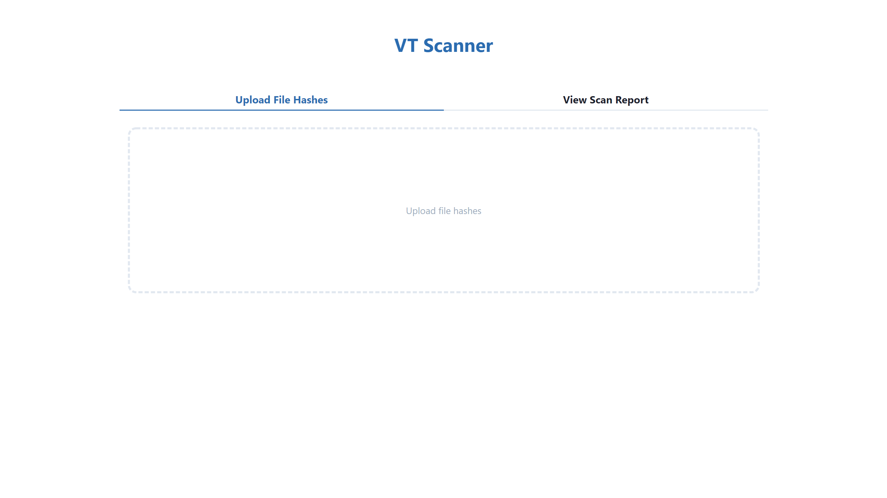
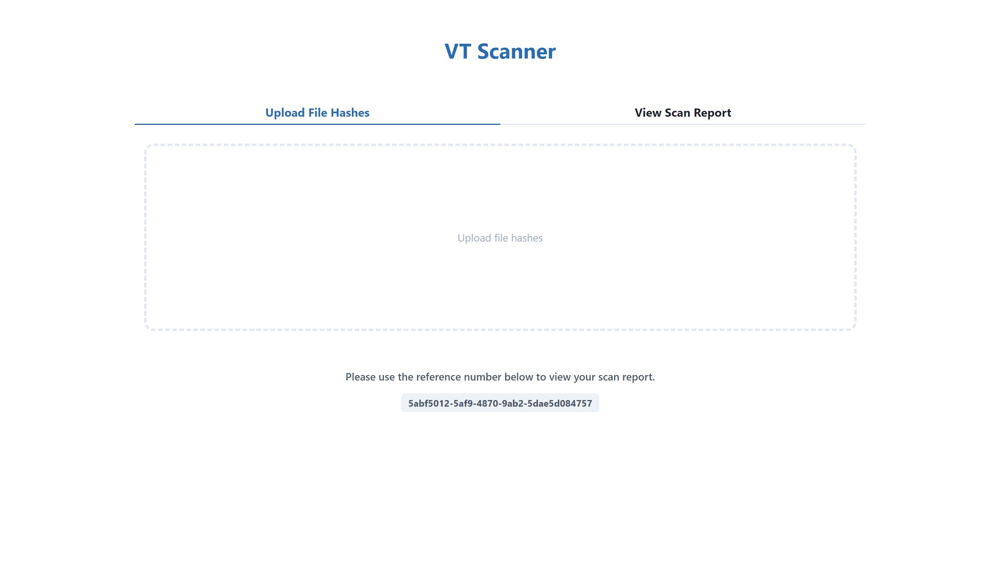
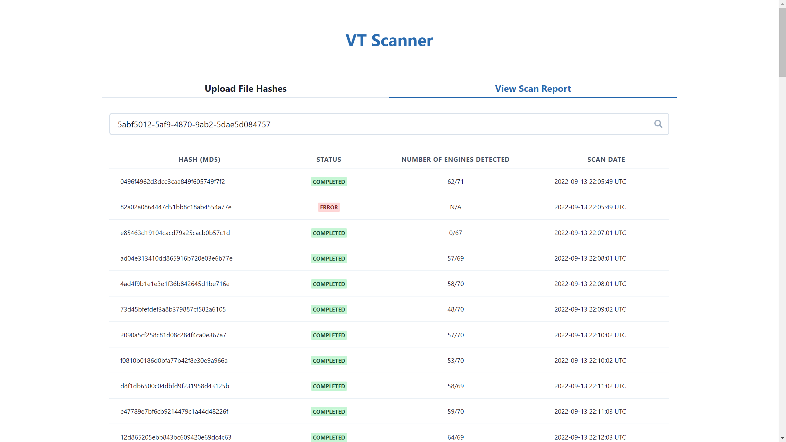

# [VT-Scanner](https://vtscanner.herokuapp.com/)

## About the Project
Bulk scan file hashes though VirusTotal API.

## Technology Stack
#### Front-End
* React
* Next
* Chakra UI
#### Back-End
* Flask
* Flask-SQLAlchemy
* MySQL
* APScheduler

## Directory Structure
```
vt-scanner
├── client
│   ├── components
│   │   ├── FileUpload              # FileUpload component
│   │   └── ScanReport              # ScanReport component
│   ├── pages
│   │   ├── _app.js
│   │   └── index.js                # Home page
│   ├── public
│   ├── .eslintrc.json
│   ├── next.config.js
│   ├── package.json
│   └── package-lock.json
├── server
│   ├── app
│   │   ├── __init__.py             # Bundled app
│   │   ├── analysis.py             # File analysis blueprint
│   │   ├── models.py               # Database tables
│   │   ├── tasks.py                # Scheduler tasks
│   │   └── utils.py                # Utilities
│   ├── config.json                 # App configuration
│   ├── main.py
│   ├── Pipfile
│   └── Pipfile.lock
├── .gitignore
└── README.md
```

## Getting Started
### Installing Dependencies
#### Front-End
```
cd client
npm install
```
#### Back-End
```
cd server
pipenv install
```

### Running the App
1. Clone the repo.
   ```
   git clone https://gitlab.com/ndao1104/vt-scanner.git
   ```
2. In `server`, create a `config.json` file with the following content.
   ```
   {
        "SQLALCHEMY_DATABASE_URI": "Your Database Connection String",
        "VT_API_KEY": "Your VirusTotal API Key"
   }
   ```
3. To run the client:
   ```
   cd client
   npm run dev
   ```
4. To run the server:
   ```
   cd server
   python main.py
   ```

## Usages
1. Upload the file that contains the file hashes to request a scan.
   
   
   
2. Enter the given reference number to view the scan report.
   * Status *Completed* indicates that the scan report for the searched hash is ready.
   * Status *Queued* indicates that the scan report for the searched hash is still processing.
   * Status *Error* indicates that the no scan report exists in VirusTotal's dataset for the searched hash .
   
   

## Design Decisions
* Due to the size of the input list and VirusTotal quota limits, scan report may not be available immediately. Users are given a reference number that allows them to check the scan report at a later time. Requests to retrieve reports from VirusTotal are ran in background after users submit their files. 
* To avoid unnecessary requests to retrieve reports from VirusTotal, only the most recent report is saved in the database for each file hash and a new request is only submitted if the report is generated more than 1 day ago.
